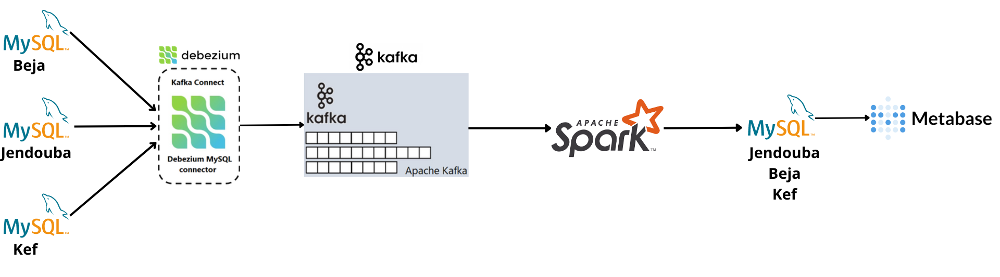
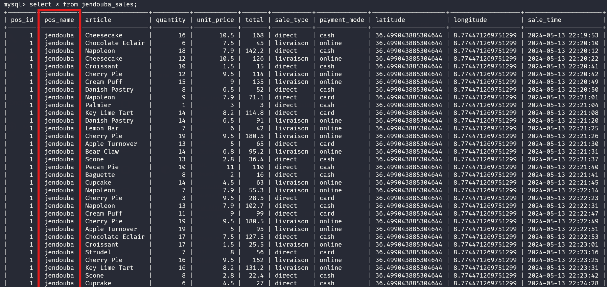
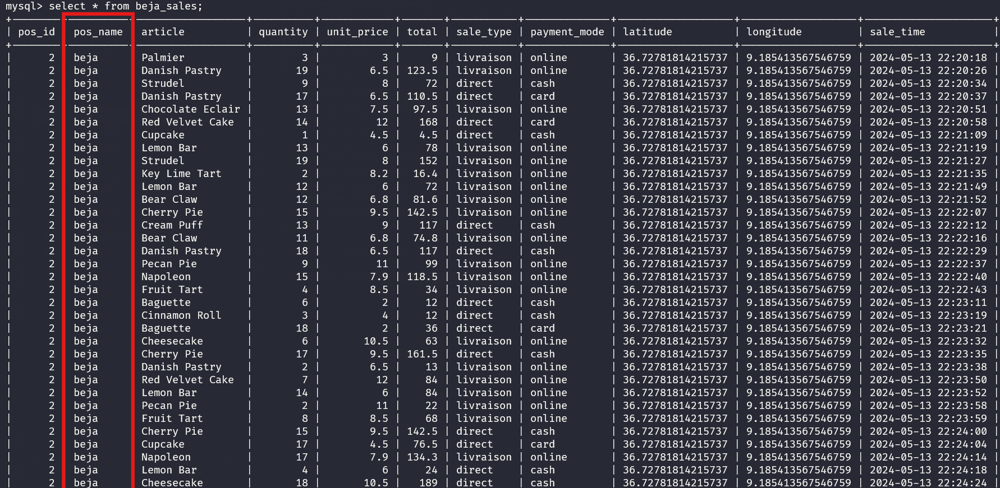
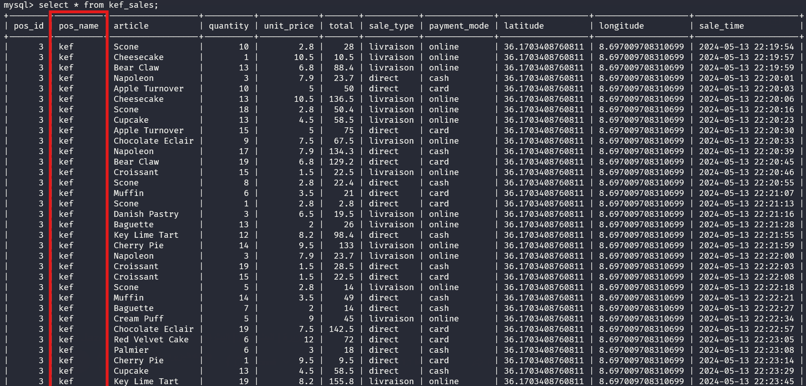
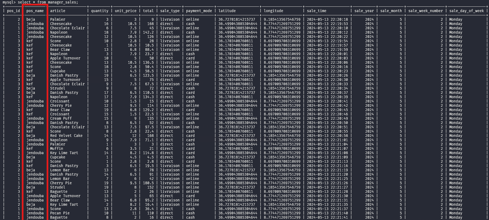
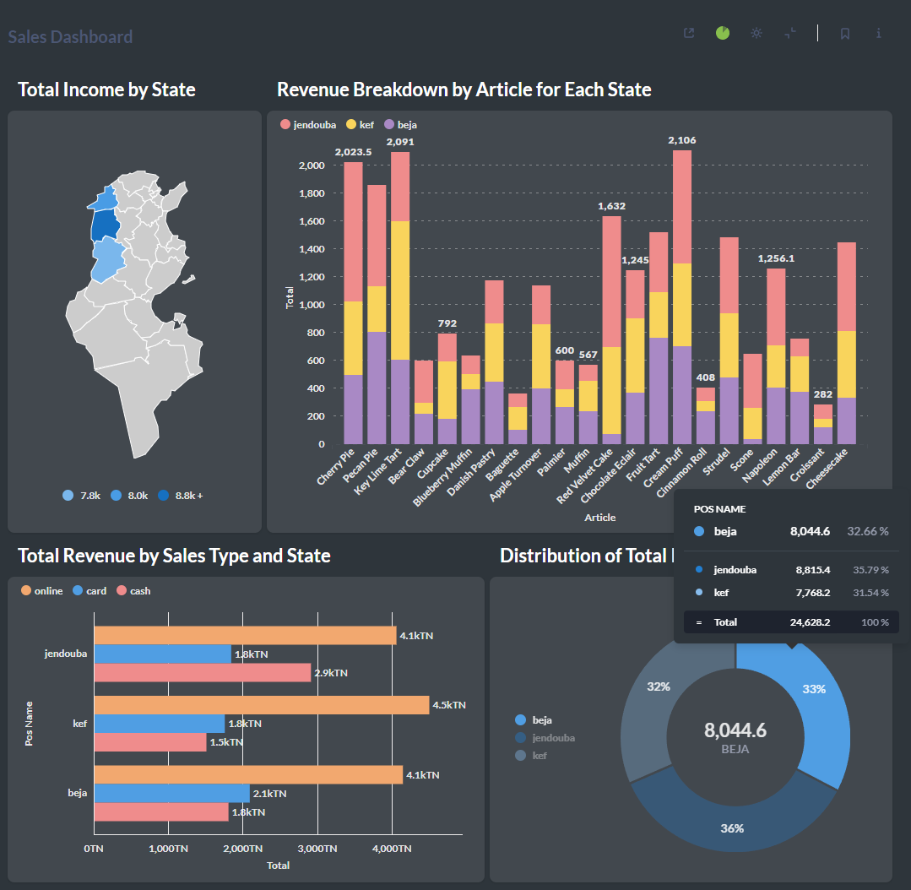
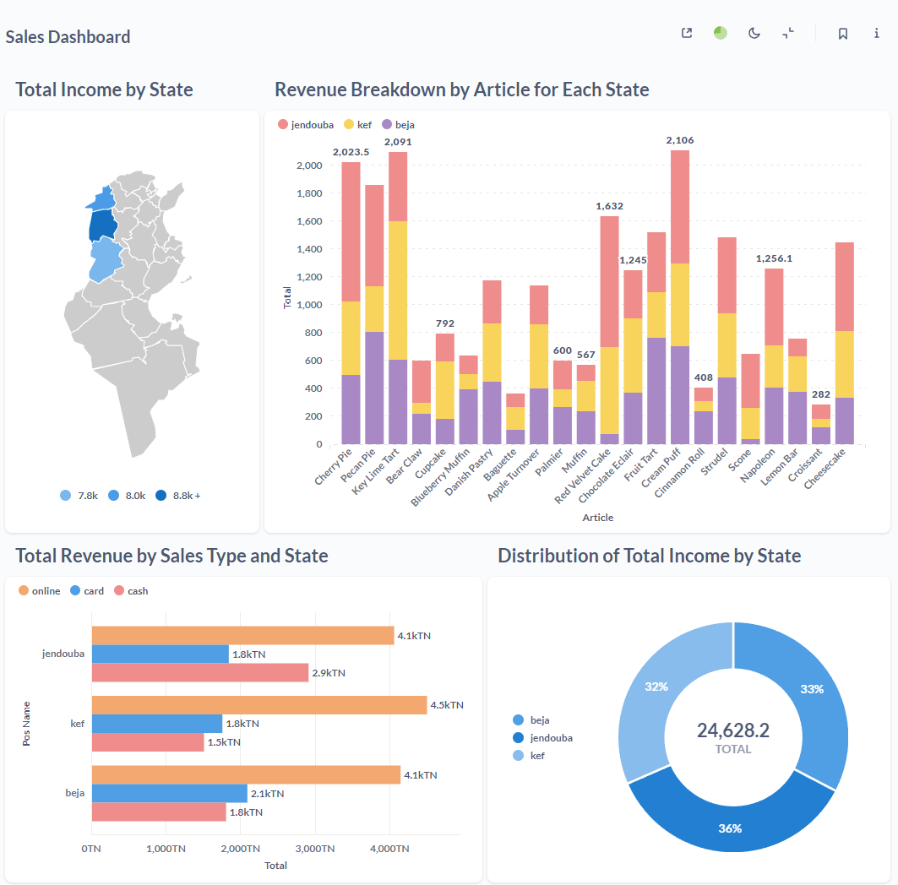
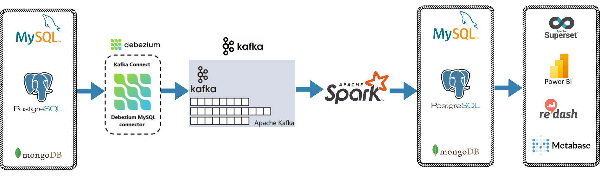

# Real-Time Sales Data Pipeline with Kafka, Debezium, Spark, MySQL, and Metabase

<div style="text-align:center;">
    
</div>

This repository provides a real-time sales data pipeline that captures data changes from multiple MySQL databases using Debezium connectors, processes the data with Spark, stores it in a MySQL database, and visualizes it through Metabase. It offers a comprehensive solution for streaming data analysis and visualization.

## Getting Started:

Follow these steps to set up and run the Real-Time Sales Data Pipeline:

### 1. Clone the Repository:

```bash
git clone https://github.com/saadkh1/Real-Time_Sales_Data_Pipeline_Kafa_Debezium_Spark_MySQL_Metabase
```
### 2. Navigate to the Project Directory:

```bash
cd Real-Time_Sales_Data_Pipeline_Kafa_Debezium_Spark_MySQL_Metabase
```

### 3. Run Docker Compose:

* Windows:
```bash
run.bat
```
This command will use Docker Compose to start all the necessary Docker containers, including Kafka, Debezium, Spark, MySQL, and Metabase. It will also set up the necessary configurations for Debezium to capture data changes from MySQL databases.


## Pipeline Overview:

### 1. Data Generation :
* The `api-mysql` service generates synthetic sales data and inserts it into MySQL databases for different states (Jendouba, Beja, Kef).

<div style="display:flex;">
    
    
    
</div>

### 2. Data Capture with Debezium:
* Debezium connectors capture data changes from MySQL databases and stream them to Kafka topics.

### 3. Data Processing by Spark:
* A Spark job continuously reads data from the Kafka topics.
* The data is processed (data transformations).
  
### 4. Data Storage in MySQL:
* The processed data is saved to the MySQL database (manager_table).


<div style="text-align:center;">
    
</div>

### 5. Data Visualization with Metabase:
* Metabase dashboards are created to visualize the real-time sales data stored in the MySQL database manager_table.

<div style="display:flex;">
    
    
</div>


&nbsp;


&nbsp;


&nbsp;


**For more details and an end-to-end stream pipeline project, contact me via email at [saadkhemiri123@gmail.com](mailto:saadkhemiri123@gmail.com).**


<div style="text-align:center;">
    
</div>
